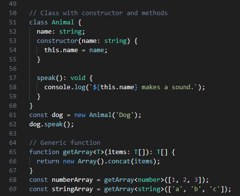

## Frosted Node Theme for VS Code

Frosted Node Theme is a visual studio code theme inspired by [Node.js](https://nodejs.org/en). A dark, frosted look with colors that are easy on the eyes.

Theme is focused on web development — javascript, typescript, css, less and scss. 

### Installation

1. Get the latest `.vsix` version [here](https://github.com/pirren/vscode-frosted-node/releases).
2. Open Visual Studio Code.
3. Go to the Extensions.
4. Click `Views and More actions...` (three dots ...) in the top-right corner and select `Install from VSIX`.
5. Go to the installed extension `Frosted Node Theme` > `Set Color Theme` > `Frosted Node Basic`.

### TypeScript demo

### License
This theme is licensed under the MIT License. See [here](./LICENSE.md) for details.